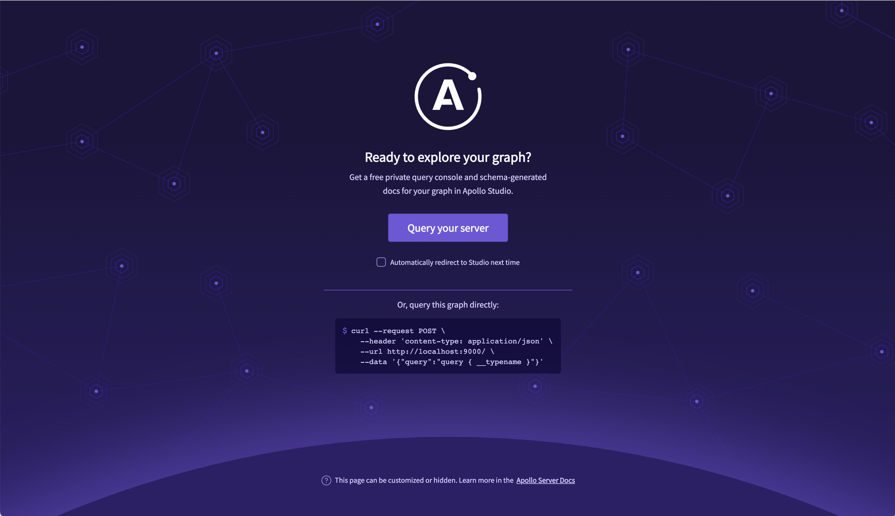
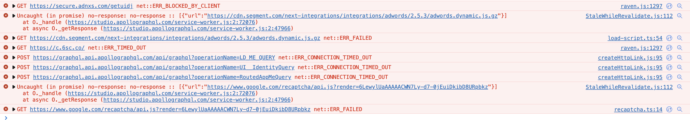
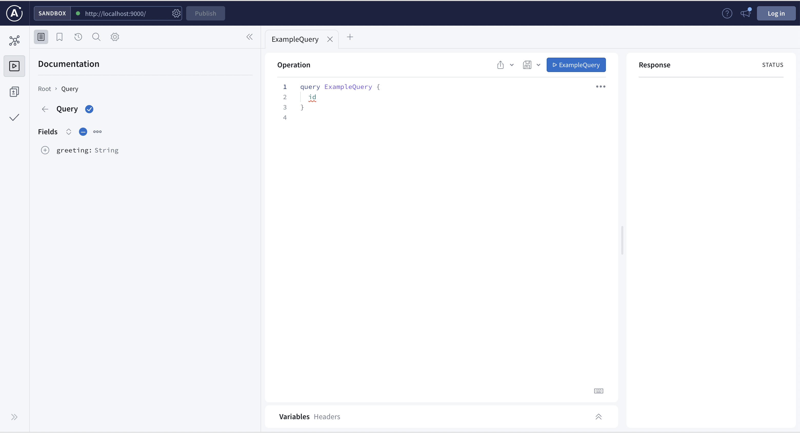

# GraphQL Demo

一个简单的 `GraphQL` demo，分为客户端（`client`）和服务端（`server`）。

## 教程

- [How to Get Started with GraphQL and Node.js](https://www.freecodecamp.org/news/get-started-with-graphql-and-nodejs/)

## 运行

### 服务端

进入 server 目录下之后，运行`node server.js`或者`npm run server`，命令行内出现`Server running at http://localhost:9000/`后，表示服务启动成功。然后在浏览器输入`http://localhost:9000`，会出现以下界面：



提示使用`Apollo Studio`或者`curl`访问接口，下面分别介绍这两种方式：

### Apollo Studio

点击`Query your server`，打开的过程中，console 可能会报错：



但是不影响打开。可能是墙的原因，花了我亿些时间之后，终于打开了 Studio：



在 Operation 那里输入

```
query Greeting {
  greeting
}
```

右边 Response 出现下面的信息后，说明成功了

```json
{
  "data": {
    "greeting": "Hello GraphQL !"
  }
}
```

### curl

发送一个post请求即可，用Postman之类的工具请求也是一样的。

```bash
curl --request POST --header 'content-type: application/json' --url http://localhost:9000 --data '{ "query": "query { greeting }" }'
```

响应：

```json
{ "data": { "greeting": "Hello GraphQL !" } }
```

### 客户端

使用的原生 js，没有任何框架/库。通过 ajax 或者 fetch 请求上面启动的服务即可，没有什么好说的。

## TODO

- [ ] [结合 React 使用](https://www.graphql-code-generator.com/docs/guides/react)
- [ ] TypeScript
